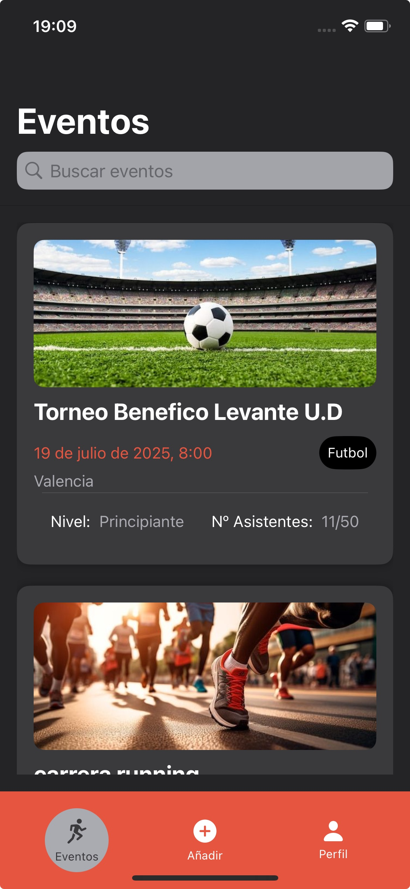
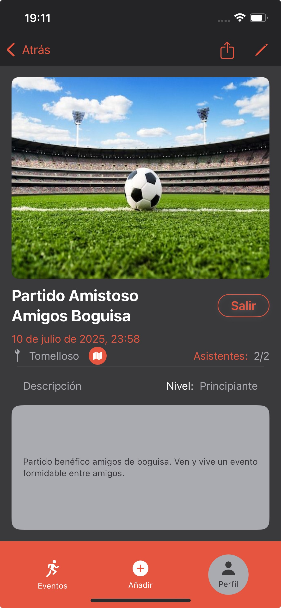
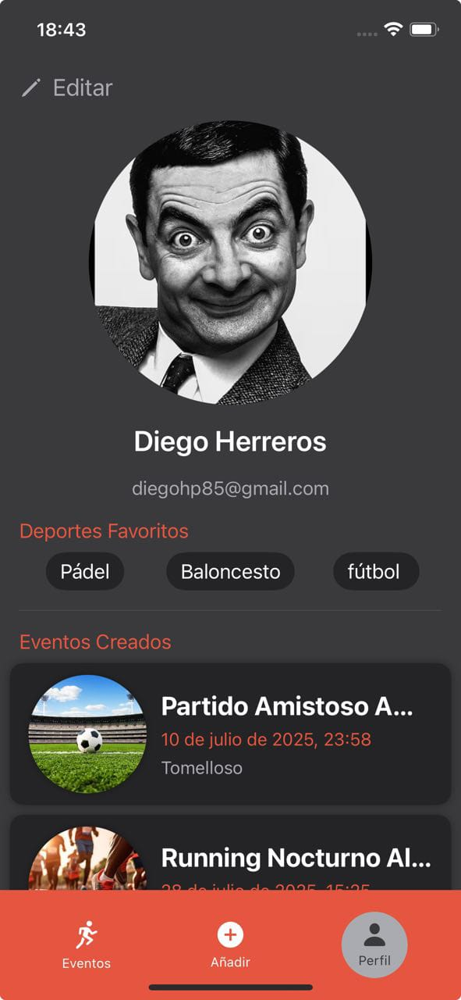

# 📱 MeetSport – App de Eventos Deportivos

**MeetSport** es una aplicación iOS desarrollada en **SwiftUI** que conecta a los usuarios con **eventos deportivos locales**, permitiéndoles descubrir, crear y unirse a partidos, torneos y quedadas deportivas en su zona.  

📲 **Descárgala gratis en App Store:**  
👉 [https://apps.apple.com/es/app/meetsport/id6749143572](https://apps.apple.com/es/app/meetsport/id6749143572)  

---

## 🛠️ Stack Tecnológico

- **Lenguaje:** Swift  
- **Framework UI:** SwiftUI  
- **Arquitectura:** MVVM  
- **Backend:** Firebase (Auth, Firestore, Storage)  
- **Servicios externos:** MapKit, Notificaciones Push, Compartir en redes sociales  

---

## 🚀 Funcionalidades Principales

- 🔍 Explorar eventos deportivos por deporte, ubicación y fecha  
- 📝 Crear, editar y eliminar eventos  
- 🙋 Confirmar asistencia a partidos o quedadas  
- 📲 Notificaciones push para recordatorios y actualizaciones  
- 🗺️ Mapas integrados con navegación al evento  
- 👤 Gestión de perfil (foto, deportes favoritos, email)  
- 📤 Compartir eventos en redes sociales  

---

## 🎯 Mi Rol en el Proyecto

Lideré el desarrollo de **principio a fin**:  
- Diseño de arquitectura y experiencia de usuario.  
- Desarrollo completo de la app en **SwiftUI**.  
- Integración con **Firebase** (Auth, Firestore, Storage) y **MapKit**.  
- Configuración de notificaciones push y funciones de compartición.  
- Ciclo completo de publicación: **TestFlight → App Store**.  
- Gestión del proyecto, pruebas con usuarios y mejoras continuas.  

---

## 📸 Capturas de Pantalla

| Inicio | Detalle Evento | Usuario 
|---------|----------|---------|
|  |  |  |

---

## 🔒 Repositorio

El código fuente de **MeetSport** se encuentra en un repositorio privado por motivos de confidencialidad.  

Este repositorio público actúa como **presentación técnica y de producto**.  

📫 Contacto: [diegohp85@gmail.com]  
🔗 LinkedIn: [Diego Herreros Parrón](https://www.linkedin.com/in/diego-herreros-parrón-b73a0121b)  

---

## 📦 Estado del Proyecto

- 📲 Disponible en App Store  
- 🧪 En pruebas con usuarios reales  
- 🔄 Iteraciones ágiles con feedback continuo  

---

## 💡 Valor del Proyecto

MeetSport demuestra mi capacidad para:  
- ✅ Desarrollar un producto **real y publicado** en App Store  
- ✅ Aplicar **SwiftUI + Firebase + MapKit** en un entorno de producción  
- ✅ Gestionar un proyecto end-to-end (arquitectura, desarrollo, testing, publicación)  
- ✅ Integrar feedback de usuarios en ciclos de mejora rápida  

Un ejemplo claro de cómo combino **desarrollo técnico + diseño centrado en el usuario** para entregar un producto funcional y escalable.  
